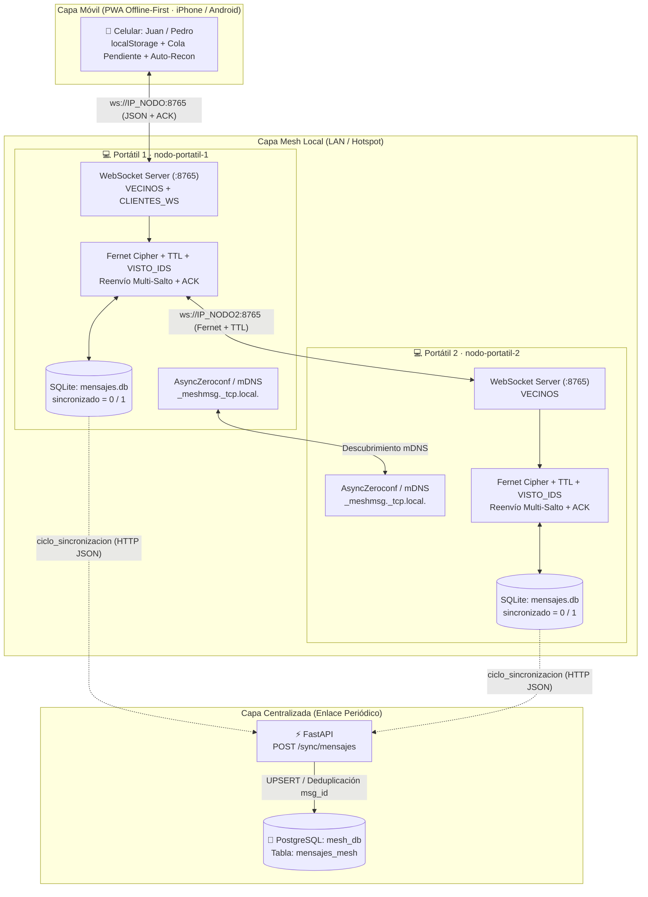
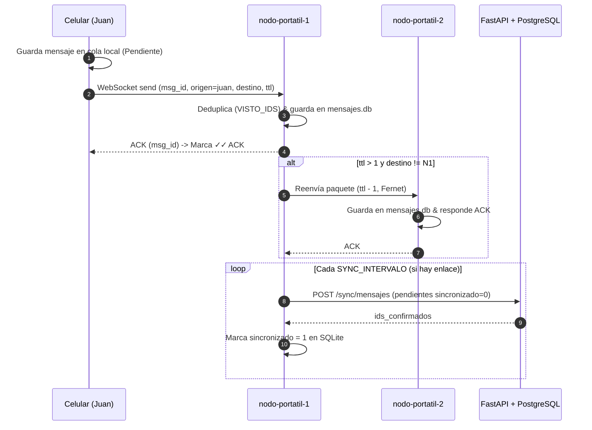

## Arquitectura del Sistema Mesh Híbrido

```mermaid
flowchart TB
    subgraph MOVIL["Capa Móvil (PWA Offline-First · iPhone / Android)"]
        CEL1["📱 Celular: Juan / Pedro<br/>localStorage + Cola Pendiente + Auto-Recon"]
    end

    subgraph MALLA["Capa Mesh Local (LAN / Hotspot)"]
        subgraph NODO1["💻 Portátil 1 · nodo-portatil-1"]
            WS1["WebSocket Server (:8765)<br/>VECINOS + CLIENTES_WS"]
            MDNS1["AsyncZeroconf / mDNS<br/>_meshmsg._tcp.local."]
            CORE1["Fernet Cipher + TTL + VISTO_IDS<br/>Reenvío Multi-Salto + ACK"]
            DB1[("SQLite: mensajes.db<br/>sincronizado = 0 / 1")]
        end

        subgraph NODO2["💻 Portátil 2 · nodo-portatil-2"]
            WS2["WebSocket Server (:8765)<br/>VECINOS"]
            MDNS2["AsyncZeroconf / mDNS<br/>_meshmsg._tcp.local."]
            CORE2["Fernet Cipher + TTL + VISTO_IDS<br/>Reenvío Multi-Salto + ACK"]
            DB2[("SQLite: mensajes.db<br/>sincronizado = 0 / 1")]
        end
    end

    subgraph NUBE["Capa Centralizada (Enlace Periódico)"]
        API["⚡ FastAPI<br/>POST /sync/mensajes"]
        PG[("🐘 PostgreSQL: mesh_db<br/>Tabla: mensajes_mesh")]
    end

    CEL1 <-->|"ws://IP_NODO:8765 (JSON + ACK)"| WS1
    WS1 --> CORE1
    CORE1 <--> DB1
    MDNS1 <-->|"Descubrimiento mDNS"| MDNS2
    CORE1 <-->|"ws://IP_NODO2:8765 (Fernet + TTL)"| WS2
    WS2 --> CORE2
    CORE2 <--> DB2

    DB1 -.->|"ciclo_sincronizacion (HTTP JSON)"| API
    DB2 -.->|"ciclo_sincronizacion (HTTP JSON)"| API
    API -->|"UPSERT / Deduplicación msg_id"| PG
```

## Flujo de Mensajería y Sincronización (Secuencia)

```mermaid
sequenceDiagram
    autonumber
    participant Cel as Celular (Juan)
    participant N1 as nodo-portatil-1
    participant N2 as nodo-portatil-2
    participant Sync as FastAPI + PostgreSQL

    Cel->>Cel: Guarda mensaje en cola local (Pendiente)
    Cel->>N1: WebSocket send (msg_id, origen=juan, destino, ttl)
    N1->>N1: Deduplica (VISTO_IDS) & guarda en mensajes.db
    N1-->>Cel: ACK (msg_id) -> Marca ✓✓ ACK
    alt ttl > 1 y destino != N1
        N1->>N2: Reenvía paquete (ttl - 1, Fernet)
        N2->>N2: Guarda en mensajes.db & responde ACK
        N2-->>N1: ACK
    end
    loop Cada SYNC_INTERVALO (si hay enlace)
        N1->>Sync: POST /sync/mensajes (pendientes sincronizado=0)
        Sync-->>N1: ids_confirmados
        N1->>N1: Marca sincronizado = 1 en SQLite
    end
```
